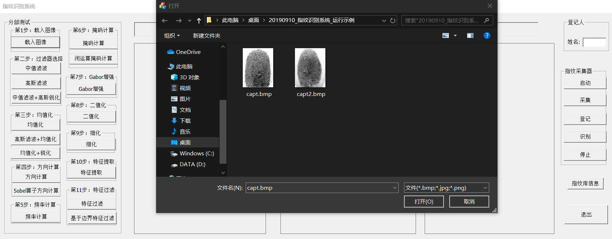

# 指纹识别系统
#### 程序的整体效果如下

#### 一 . 系统运行的前期准备（本程序使用是指纹采集器 中控ZK4500_驱动已经相关的配套的指纹采集器）

1. 首先应该安装指纹采集器_中控ZK4500_驱动
2. 安装vs2019已经MFC对应在vs2019的C++框架
3. 本程序没有连接数据库，使用的本地创建文件夹存储，结果图、分步图、指纹库相关信息都存储在本地中

#### 二.文件目录结构

详细代码见code文件夹中，主要算法代码为FingerDlg.cpp文件

#### 三.系统界面解释

**程序一共分为三个部分**

第一部分：

​	界面的左侧的分步测试，这里可以看出对指纹识别的分布执行，每点	击一个按	钮，会在程序的第一和第二个方框中显示结果，第一个方框显示处理的	上步的	结果而第二个方框显示的按钮对应的方法处理后的结果。

第二部分：

​	程序中间的三个方框已经三个方框上的提示框长条。左边和中间的方框是用来显	示分步测试的的结果对比的，而右边的方框是用来显示动态的指纹采集器采集的	指纹。提示长条显示的分步测试后的提示语。

第三部分：

​	这里是登记和识别功能，用户可以通过动态的指纹采集器采集指纹，然后输入姓	名登记，然后可以通过指纹来识别用户的身份。指纹库的信息，可以显示有关指	纹库中含有多少条指纹信息。

#### 四.系统分步测试相关操作

​	分步测试一共分为11步。

​	其中对于每一步来说，如果选择有多个，可以选择其中的一个（对比后选择效果	较好的方法），但是11步不能缺少其中的任何一部，否则会出现效果差或者报错	的问题。

​	例如可以使用这样的处理顺序：

1. 载入图像
2. 中值滤波+高斯锐化
3. 均值化+锐化
4. 方向计算
5. 频率计算
6. 掩码计算
7. Gabor增强
8. 二值化
9. 细化
10. 特征提取
11. 基于边界特征过滤

经过以上处理可以得到提取的指纹的相关的特征信息对应的结果图分别处理结果图如下：

1. 

   

2. 

3. 

4. 

5. 

6. 

7. 

8. 

9. 

10. 

11. 

#### 五.系统如何使用登记和识别功能

​	1.点击“启动”按钮，在弹出采集器连接成功后进行下部操作，否则检查时候已经成功按照驱动以及是否连接好指纹识别器。

​	2.将手指放在采集器上可以看到，指纹在右方的方框中显示，调整自己的指纹，然后得到一个较清晰指纹图像。

​	3.在姓名框输入相关的姓名，然后点击“登记”按钮，等待一段时间后可以看到左边的两个方框中分别依次显示采集图片以及处理后的得到的特征点，同时提示框	显示是否已经登记成功。

​	4.再次采集指纹，相关的操作见步骤2然后得到较清晰的图片后，点击“采集”按           钮，然后点击“识别”按钮，等待一段时间后可以看到提示框出显示出识别出来的相关的信息，已经是否识别成功，如果识别失败，则会显示识别失败。

#### 六.系统创新点

1.在过滤器选择方面，使用中值滤波和高斯滤波进行对比，已经区分使用一元高斯滤波和二元高斯滤波算法的异同。创新使用高斯锐化来对图像进行增强处理，增强指纹的纹理以及去除高斯噪声。

2.均值化方面，使用了二元高斯滤波来进一步的去除噪音，并且再次使用高斯锐化来对图像进行增强处理。

3.对于方向计算的方法，使用Sobel算法八方向求梯度，可以相比原算法更好的提取出图像题梯度信息。

4.掩码计算使用了闭运算的方法，先腐蚀后扩展的方法，充分的平滑边缘信息，从而可以得到更好的边缘信息特征。

5.对于特征过滤算法，我使用基于边界的特征过滤算法，通过限制距离重心的位置来选择特征点，可以有效的减少特征点的数量，并且可以加快程序的运行速度、减少程序运行时所需要的空间压力。

